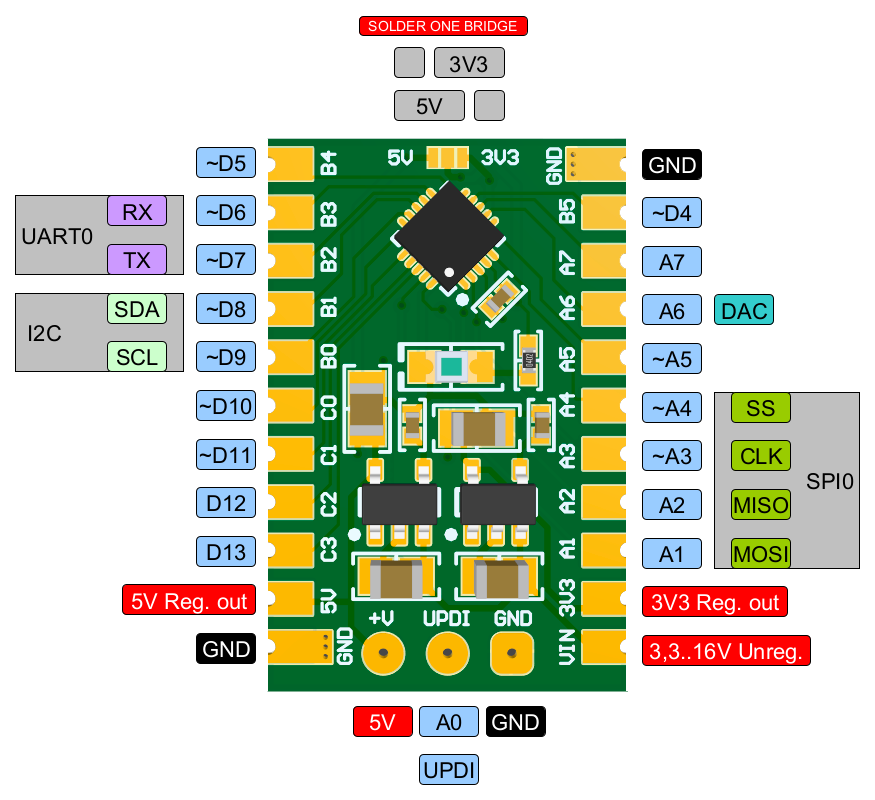

# ATtiny1616-Minima
Minimal ATtiny1616 development board.

[Schematic](https://github.com/nerovny/ATtiny1616-Minima/blob/main/Minima_schematic.pdf)

[Gerber files](https://github.com/nerovny/ATtiny1616-Minima/tree/main/Gerber%2BNC%20Drill)

- UPDI programming;
- 5v and 3v3 voltage regulators;
- breadbord-friendly 2.54 headers pinout;
- up to 15v VIN power;
- big ass reset button.

